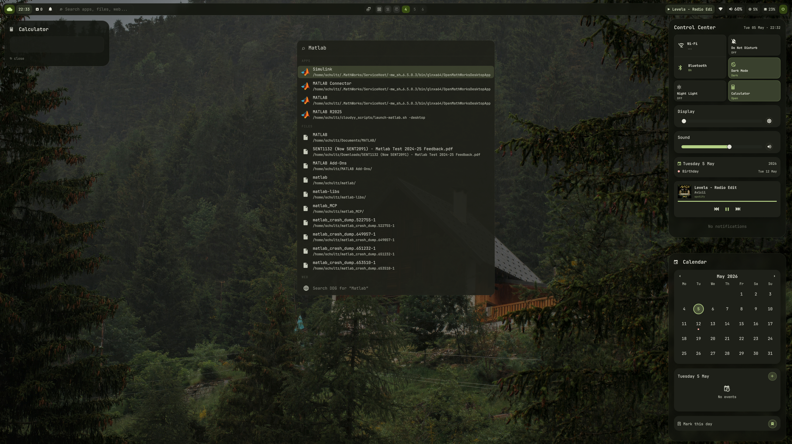
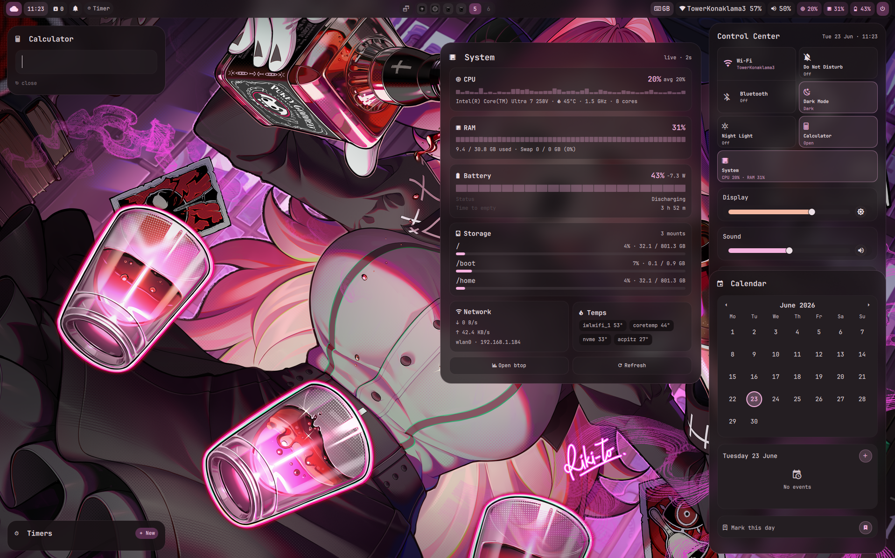
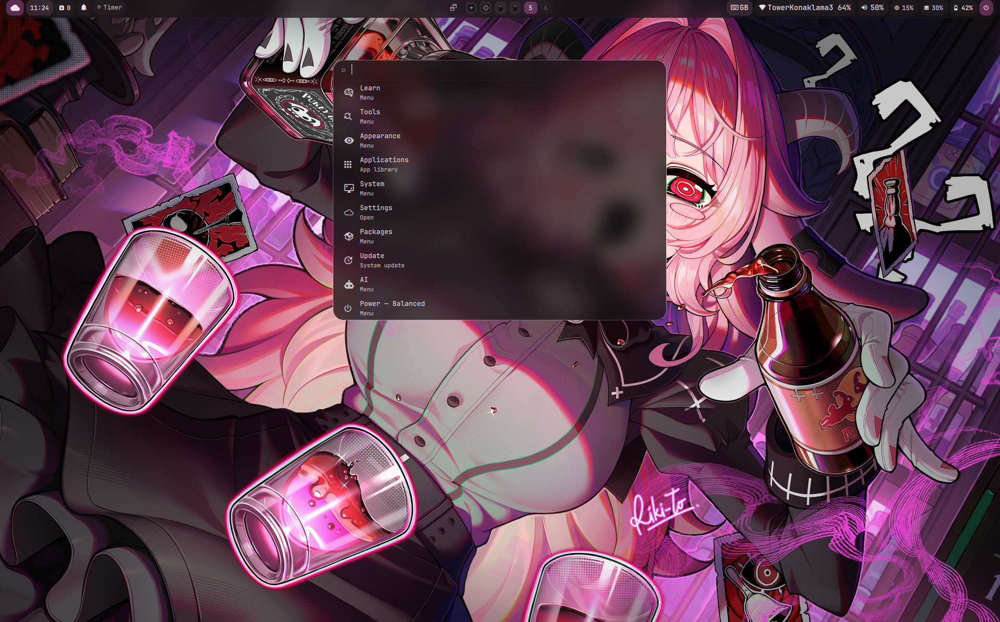
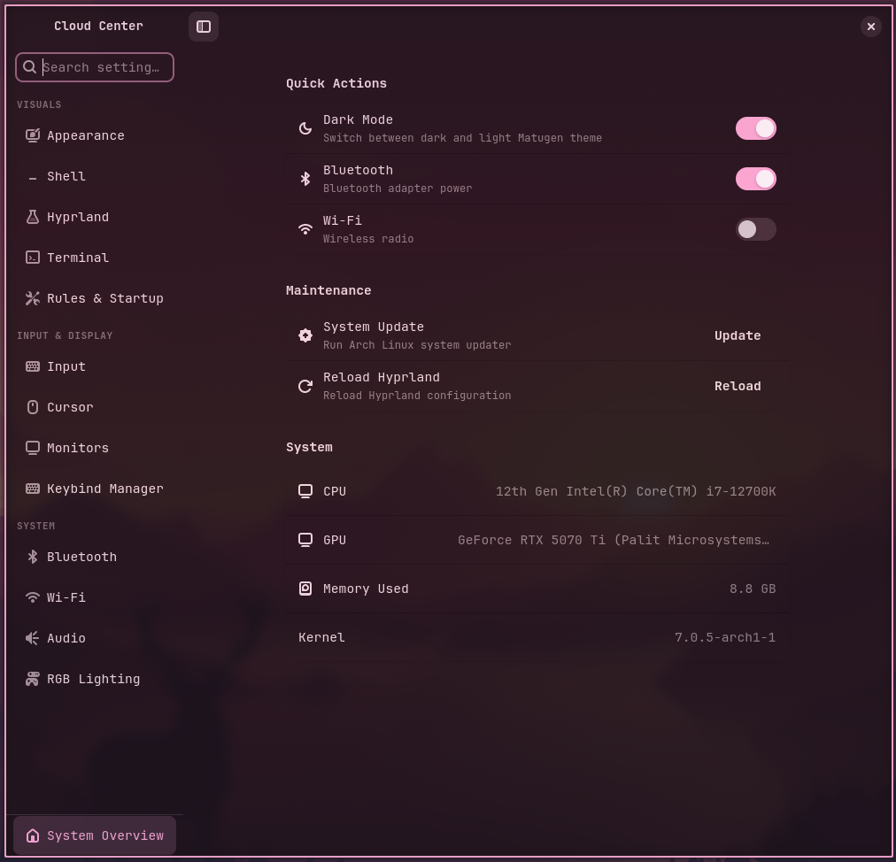
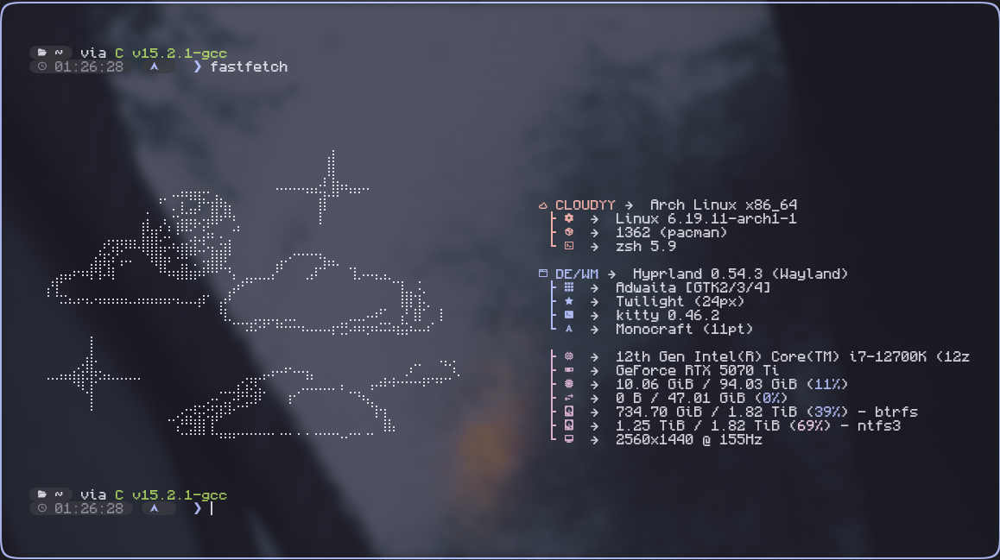
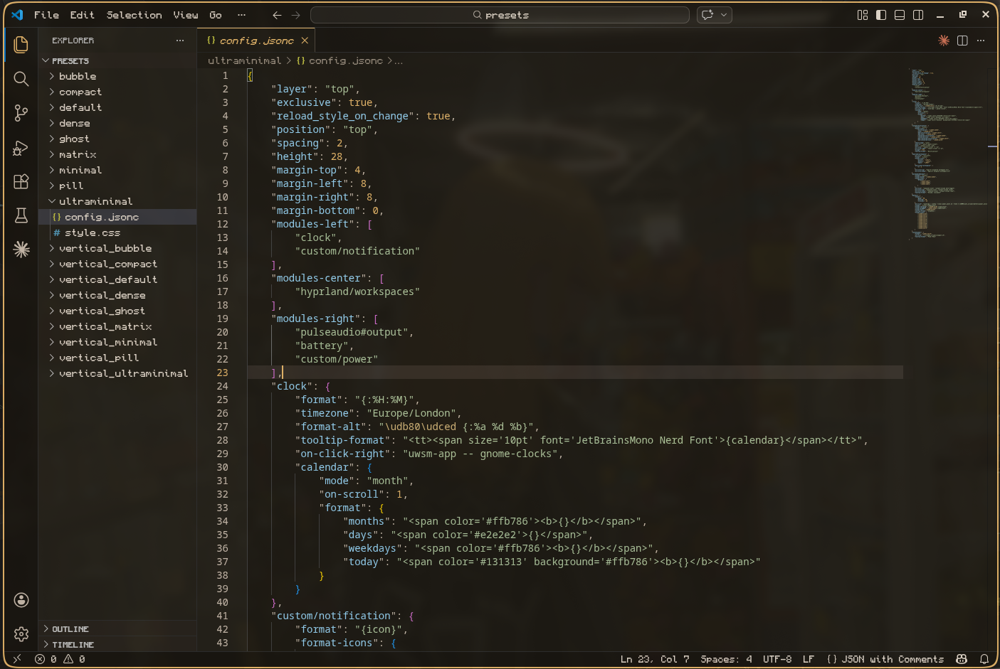

Disclaimer: Some of the things in this projects are written with AI, as this is a work in progress project I will overwrite and fix things as I go, but AI makes my student life easier. Thanks! Enjoy the dotfiles.

A Hyprland rice for Arch Linux (and SOON NixOS). A lot of things are inspired by MacOS. A lot of the utility in this rice is adjusted specific for developers. 

## Install

```bash
git clone https://github.com/schultz-dev0/cloudyy-linux ~/cloudyy-linux
~/cloudyy-linux/install/install.sh
```

Follow the prompts, the installer handles GPU detection, package selection, dotfiles symlinking, and service setup automatically. Resumes from the last checkpoint if interrupted.

## Usage

!Most features are shown in this video: https://www.youtube.com/watch?v=rspzOLU1LwU
New video soon with the latest feature set. 

## Quickshell overview







## previews:
- **Cloud center**



- **Fast fetch**



- **Vscode/vscodium theming via matugen**




