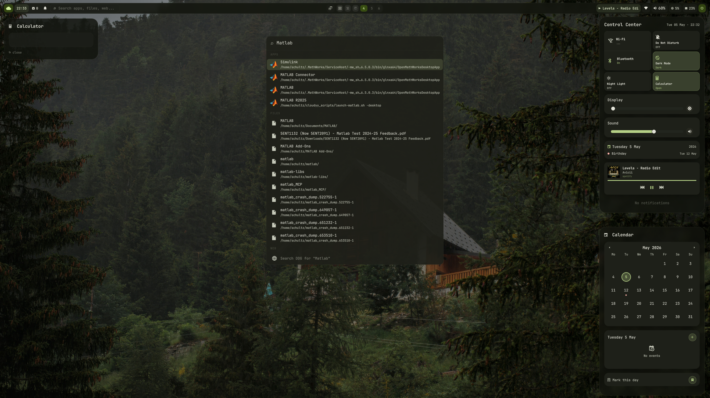
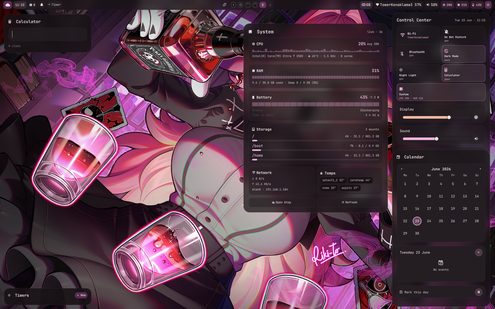
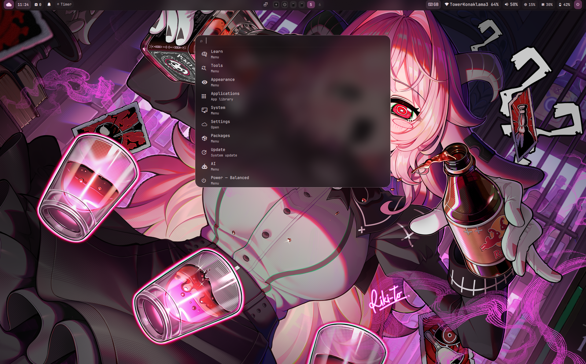
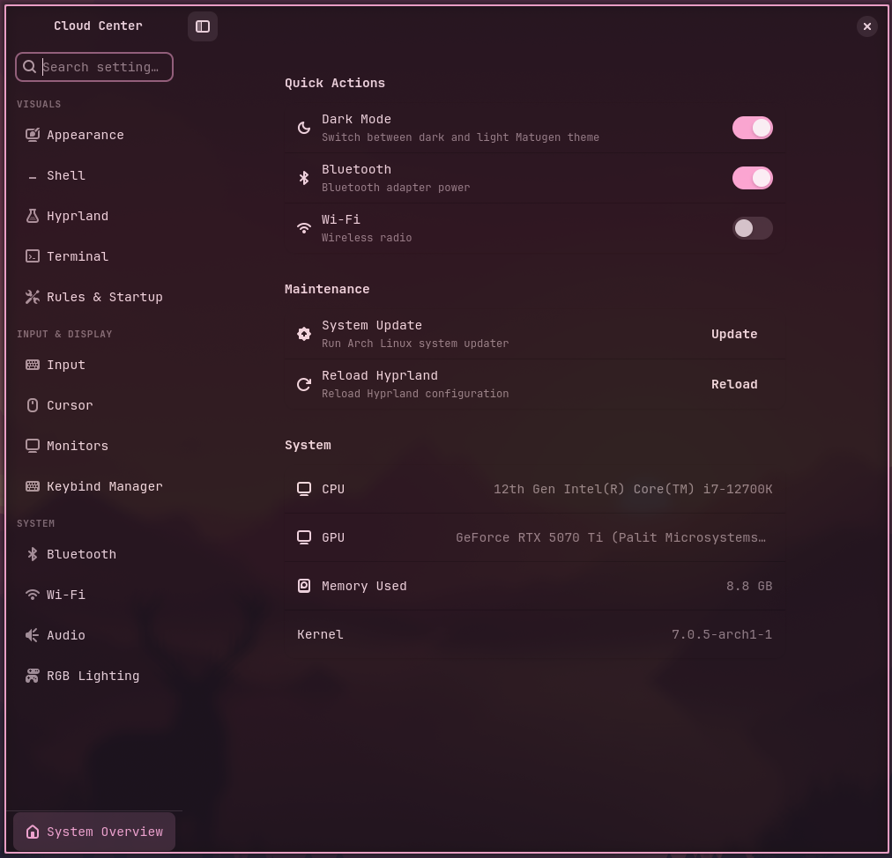
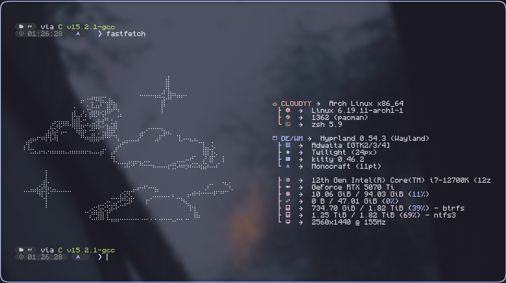
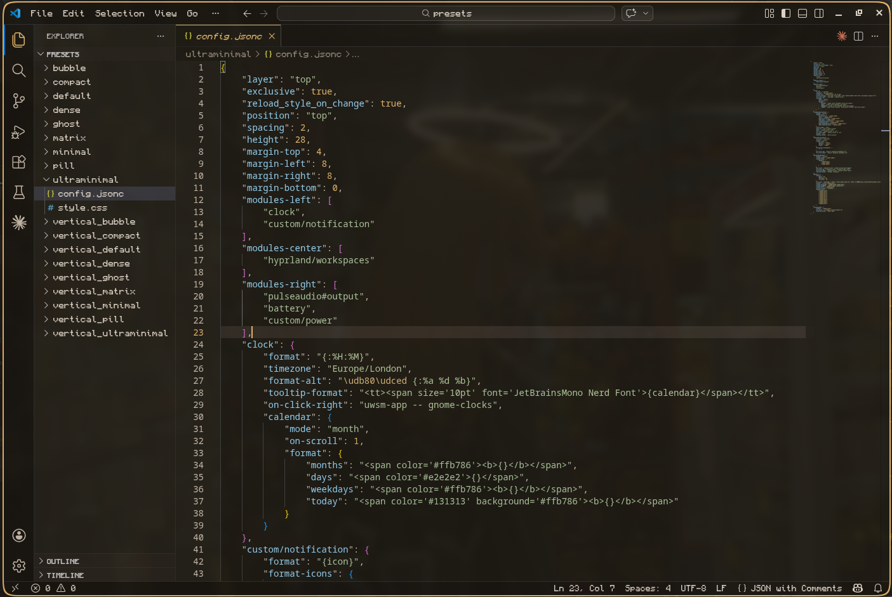

## Install

```bash
git clone https://github.com/schultz-dev0/cloudyy-linux ~/cloudyy-linux
~/cloudyy-linux/install/install.sh
```







## previews:
- **Cloud center**



- **Fast fetch**



- **Vscode/vscodium curated theme integration**




